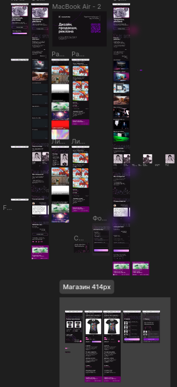

# KommunityFrontend

Репозиторий с лендингом для студии дизайна Kommunity

Vue 3 Composition API, Pinia

Посмотреть ход работы можно [тут](https://community42.ru)

### INSTALL GUIDE
  - На Mac/Linux установить `Docker` и опционально `Make`
  - На Windows разбирайтесь сами, с WSL там поколдуете, разберётесь
  - `make build && make up` - попадёте в терминал контейнера, там предустановлен zsh для удобства разработки
  - Зависимости для проекта добавлять тоже через терминал контейнера, `node_modules` синхронизированы в реалтайме
  - Остальные команды описаны в `Makefile`

- [ ] Вёрстка для ПК приняла ислам
- 
  